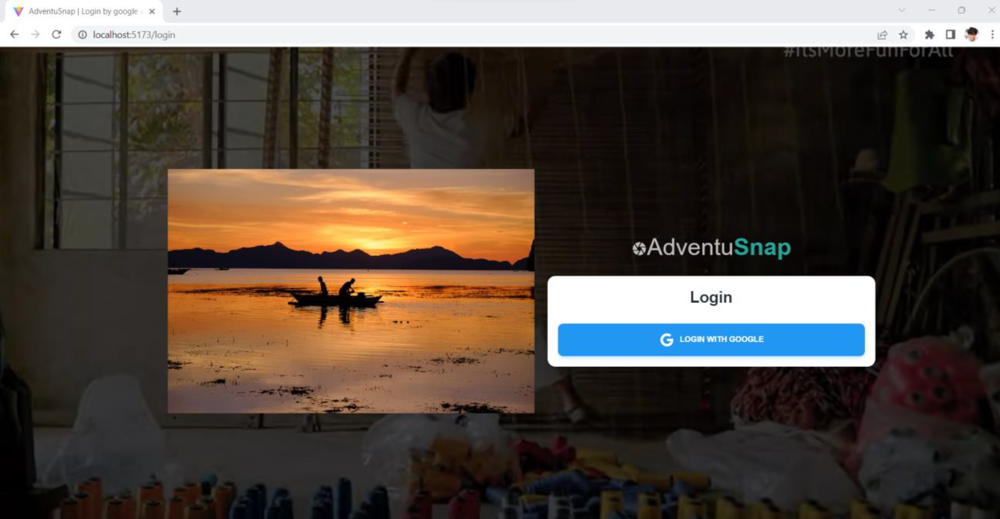

# 🌍 AdventuSnap

AdventuSnap is an innovative travel social media application built for adventurous souls who seek to share and discover authentic travel experiences. Focused on raw, unfiltered visuals and storytelling, AdventuSnap connects travel enthusiasts across the Philippines through genuine snapshots and stories behind each journey.

## ✨ Features

- 📸 Upload & Share: Capture and share raw travel moments — no filters, just authenticity.

- 🗺️ Interactive Map: Explore the Philippines by clicking on provinces to view user-submitted snaps.

- 👥 Connect & Comment: Follow fellow travelers, engage with their posts, and leave meaningful comments.

- 🔎 Search Functionality: Find snaps by image title, user, or province name.

- 🖼️ Browse by Province: Easily browse all photos submitted from specific locations.

- 🔐 Google Auth Login: Secure login via Firebase using a valid Gmail account.

- 🧑 User Profile Page: View and manage your personal image collections.

- ⚙️ Responsive Design: Optimized for all screen sizes.

- 🗺️ Interactive Travel Map

- Discover travel stories and photographs based on geographic locations:

- Click on any province in the Philippines to view photos taken there.

- Select an image to highlight it and explore similar snaps from the same area.

## 🧰 Tech Stack

- Frontend: ReactJS, Tailwind CSS, React-Material UI

- Authentication: Firebase (Google Auth)

- Database: Sanity.io

- Maps: External Map.js integration

- Project Management: Trello

## 📂 App Pages & Flow
- Page Name	Description
- Landing Page - Welcome screen with app intro
- Login Page - Google Auth via Firebase
- Home Page - Feed of user snaps
- Discover Places - Explore places like Manila, Abra, etc.
- Browse Collection - View all uploaded images
- My Collections - View personal uploads
- Add Snap - Upload a new travel photo
- User Settings - Manage account settings
- Quick Explore - Interactive map browsing
- Image Highlight - View selected image and related snaps, comment section

## 📸 Preview & Demo

## 🎥 Watch the Demo: [YouTube Video](https://youtu.be/s6UazYZ28MM)

## 🗂️ Project Board: [Trello Workspace](https://trello.com/invite/b/ydLRyVxq/ATTIe298013942d966d917890d618c82daef38FBF662/v88-fe-capstone)

## 🚀 Everything thanks to cources from [javascriptmastery](https://www.youtube.com/@javascriptmastery)

# [BE Link](https://github.com/DexterVargas/FE_CAPSTONE_backend)